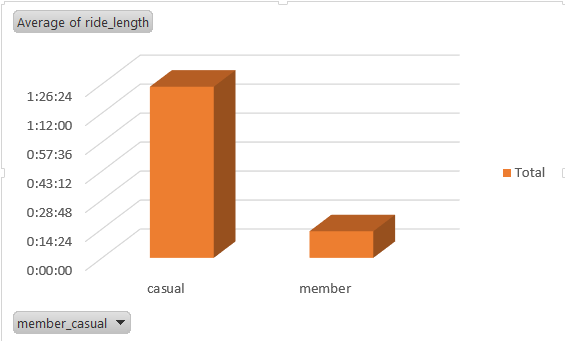
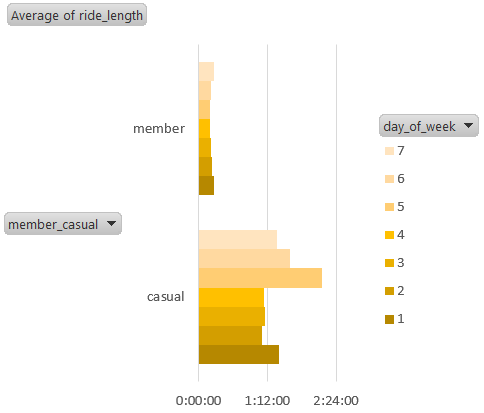

# Cyclistic Bike-share Analysis

## 1. Business Task
Analyze how annual members and casual riders use Cyclistic bikes differently, and suggest strategies to convert casual riders into annual members.

## 2. Data Source
- Original trip data from Motivate International Inc. (12 months)
- `data_raw/`: Original downloaded CSV files
- `data_clean/`: Cleaned files (added `ride_length`, `day_of_week`)
- `data_final/`: Combined file used for pivot table analysis

## 3. Data Cleaning (Process)
- Removed invalid records (e.g., negative or zero ride_length)
- Created `ride_length` by calculating `end_time - start_time`
- Extracted `day_of_week` from start_time
- Standardized `member_casual` values
- Formatted date/time to ensure accurate pivot table calculations

## 4. Analysis & Insights

### 4.1 Members vs Casual Riders
- Casual riders have **significantly longer ride durations** than members.
- Members’ ride durations are **very consistent**, typically between **10–20 minutes**.
- Casual riders’ average duration often exceeds **1 hour**, and on certain days reaches **nearly 2 hours**.

**Interpretation:**
- Casual riders are likely using the service for **leisure, sightseeing, or weekend outings**, not commuting.
- Members are likely daily commuters using the bike-share for **short, direct point-to-point trips**.
- The large gap in ride length strongly suggests **different user motivations** between the two groups.

---

### 4.2 Day of Week Patterns
- Casual riders show a noticeable increase in ride duration on **Fridays** (nearly 2 hours).
- Casual usage stays relatively higher on **Saturdays and Sundays**, indicating a weekend trend.
- Members maintain consistent short ride durations across all days, suggesting routine commuting patterns.

**Interpretation:**
- The spike on Friday likely reflects **tourists or weekend travelers arriving in the city** and renting bikes for longer leisure trips.
- Weekend trends reinforce the idea that casual riders behave like **occasional leisure users**, not daily transportation users.

---

## 5. Visualizations
- Members vs Casual Riders – Average Ride Length  
  

- Average Ride Length by Day of Week  
  

---

## 6. Recommendations
Based on the above patterns, here are potential strategies to convert casual riders into annual members:

1. **Weekend Membership Promotions**  
   Casual riders who take long rides on Fridays and weekends could be offered short-term membership trials at a discount.

2. **Tourist-Focused Upsell**  
   Provide 3-day or 7-day “visitor passes” that include an option to upgrade to an annual membership at a reduced rate.

3. **Highlight Commuter Benefits**  
   Promote how members save time and money on regular weekday commutes to encourage casual riders who ride frequently to switch.
 
